# MoneyShop — Entity Relationship Diagram

```mermaid
erDiagram
    Utilizatori ||--o{ Application : "creates"
    Utilizatori ||--o{ Consent : "grants"
    Utilizatori ||--o{ Mandate : "signs"
    Utilizatori ||--o{ KycSession : "verifies"
    Utilizatori ||--o{ BcReport : "uploads"
    Utilizatori ||--o{ UserFinancialData : "has"
    Utilizatori ||--o{ ChatUsage : "uses"
    Utilizatori ||--o{ ChatRateLimit : "limited by"
    Utilizatori ||--o{ OtpChallenge : "receives"
    Utilizatori ||--o{ Session : "has"
    Utilizatori ||--o{ AnafReport : "requests"
    Utilizatori }o--|| Roluri : "has role"

    Application ||--o{ ApplicationBank : "sent to"
    Application ||--o{ Document : "has"
    ApplicationBank }o--|| Bank : "references"

    KycSession ||--o{ KycFile : "contains"

    Consent }o--|| LegalDoc : "references"

    LeadSession ||--o{ LeadCapture : "captures"

    Utilizatori {
        int IdUtilizator PK
        string Mail
        string Nume
        string Prenume
        string Parola
        string NumarTelefon
        int IdRol FK
        bool EmailVerified
        bool PhoneVerified
        string FirebaseUid
    }

    Roluri {
        int IdRol PK
        string Denumire
    }

    Application {
        int Id PK
        int UserId FK
        string TypeCredit
        string Status
        decimal RequestedAmount
        int RequestedTermMonths
        decimal SalariuNet
        string Purpose
        datetime CreatedAt
        datetime UpdatedAt
    }

    ApplicationBank {
        int Id PK
        int ApplicationId FK
        int BankId FK
        string Status
        string Notes
    }

    Bank {
        int Id PK
        string Name
        string Code
        bool IsActive
    }

    KycSession {
        guid KycId PK
        int UserId FK
        string KycType
        string Status
        string Cnp
        string Address
        datetime CreatedAt
        datetime VerifiedAt
    }

    KycFile {
        int Id PK
        guid KycSessionId FK
        string FileType
        string FileName
        string FilePath
    }

    Consent {
        guid ConsentId PK
        int UserId FK
        guid DocId FK
        string ConsentType
        string Status
        datetime GrantedAt
    }

    LegalDoc {
        guid DocId PK
        string DocType
        string Title
        string Content
        int Version
    }

    Mandate {
        guid MandateId PK
        int UserId FK
        string MandateType
        string Scope
        string Status
        datetime GrantedAt
        datetime ExpiresAt
    }

    BcReport {
        int Id PK
        int UserId FK
        string FileName
        int FicoScore
        decimal ExistingMonthlyObligations
        string ParsedDataJson
        datetime CreatedAt
    }

    UserFinancialData {
        int Id PK
        int UserId FK
        decimal SalariuNet
        decimal VenitTotal
        decimal SoldTotal
        decimal Dti
        int FicoScore
        string ScoringLevel
        datetime LastUpdated
    }

    Document {
        int Id PK
        int ApplicationId FK
        string FileName
        string FilePath
        string DocumentType
    }

    OtpChallenge {
        guid Id PK
        int UserId FK
        string Purpose
        string Code
        datetime ExpiresAt
        bool IsUsed
    }

    Session {
        guid Id PK
        int UserId FK
        string Token
        datetime CreatedAt
        datetime ExpiresAt
    }

    Appointment {
        int Id PK
        string Nume
        string Prenume
        string Judet
        string TipCredit
        decimal SalariuNet
        string Telefon
        string Email
        string Status
        datetime CreatedAt
    }

    BrokerDirectory {
        int Id PK
        string ExcelFileName
        string BlobPath
        int FileSize
        datetime UploadedAt
    }

    ChatUsage {
        int Id PK
        int UserId FK
        int TokensUsed
        datetime CreatedAt
    }

    AnafReport {
        int Id PK
        int UserId FK
        string ReportData
        datetime CreatedAt
    }

    LeadSession {
        int Id PK
        string SessionToken
        datetime CreatedAt
    }

    LeadCapture {
        int Id PK
        int SessionId FK
        string Email
        string Phone
        string Source
    }

    FaqItem {
        int Id PK
        string Question
        string Answer
        int OrderIndex
    }

    RatesRulesConfig {
        int Id PK
        string ConfigKey
        string ConfigValue
        datetime UpdatedAt
    }
```

## Relationship Types

| Relationship | Type | Description |
|---|---|---|
| Utilizatori → Roluri | Many-to-One | Each user has one role (Utilizator/Administrator) |
| Utilizatori → Application | One-to-Many | A user can create multiple credit applications |
| Utilizatori → KycSession | One-to-Many | A user can have multiple KYC verification sessions |
| Utilizatori → Consent | One-to-Many | A user grants multiple consents (GDPR, terms, etc.) |
| Utilizatori → Mandate | One-to-Many | A user signs mandates (ANAF, Birou Credit) |
| Application → ApplicationBank | One-to-Many | An application can be sent to multiple banks |
| ApplicationBank → Bank | Many-to-One | Each submission references one bank |
| KycSession → KycFile | One-to-Many | A KYC session contains multiple uploaded files |
| Consent → LegalDoc | Many-to-One | Each consent references a legal document version |
| Application → Document | One-to-Many | An application can have multiple supporting documents |
| LeadSession → LeadCapture | One-to-Many | A lead session captures multiple data points |
